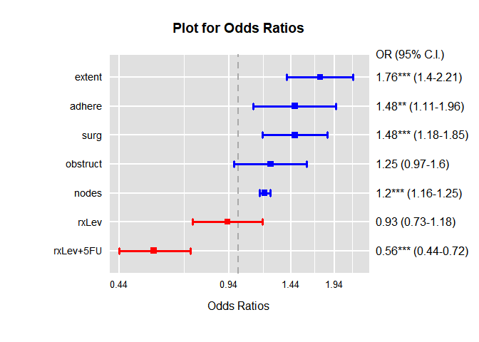

로지스틱 회귀분석
================

## 로지스틱 회귀분석

종속변수가 범주형 데이터일 때 사용되는 회귀분석 방법이다.

  - 이항형 로지스틱 회귀(binomial logistic regression) : 2개 범주(성공, 실패)
  - 다항형 로지스틱 회귀(multinomial logistic regression) : 3개 이상 범주

## 일반화 선형모형(Generalized Linear Model)

종속변수가 범주형 변수일 때의 회귀분석방법은 주로 GLM이 사용된다. 회귀분석의 정규성 가정이 위배될 때 사용되는 GLM은 주로
다음과 같은 경우에 많이 사용된다.

  - 종속변수가 범주형변수인 경우 : 이항변수(0/1, 성공/실패 등)인 경우, 다항변수(비/구름/맑음 등)인 경우
  - 종속변수가 count(예, 하루 사고 발생 건수, 하루 방문 인원 수 등)인 경우

### glm() 함수

R에서는 glm()함수를 사용함 glm()함수에 family 인수는 종속변수가 어떤 분포인가에 따라 다음과 같이 사용된다.

  - 정규분포인 경우 gaussian
  - 이항분포인 경우 binomial
  - 포아송분포인 경우 poisson
  - 역정규분포인 경우 inverse.gaussian
  - 감마분포인 경우 gamma
  - 응답분포가 확실하지 않은 때 quasi, quasibinomial, quasipoisson

## 로지스틱 회귀분석 사례

### 데이터

분석에 사용되는 데이터는 survival 패키지에 있는 대장암 데이터인 colon이다. 이 데이터는 colon cancer
1858명의 데이타이다.

  - id: id
  - study: 1 for all patients
  - rx: Treatment - Obs(ervation), Lev(amisole), Lev(amisole)+5-FU
  - sex: 1=male
  - age: in years
  - obstruct: obstruction of colon by tumour
  - perfor: perforation of colon
  - adhere: adherence to nearby organs
  - nodes: number of lymph nodes with detectable cancer
  - time: days until event or censoring
  - status: censoring status
  - differ: differentiation of tumour (1=well, 2=moderate, 3=poor)
  - extent: Extent of local spread (1=submucosa, 2=muscle, 3=serosa,
    4=contiguous structures)
  - surg: time from surgery to registration (0=short, 1=long)
  - node4: more than 4 positive lymph nodes
  - etype: event type: 1=recurrence,2=death

rx는 환자의 치료방법 Obs(ervation), Lev(amisole), Lev(amisole)+5-FU의 세군으로 나뉘고
obstruct는 종양에 의한 장의 폐쇄(obstruction), perfor은 장의 천공(perforation), adhere는
인접장기와의 유착(adherence), nodes는 암세포가 확인된 림프절의 수, differ는 암세포의 조직학적인 분화의
정도(1=well, 2=moderate, 3=poor), extent는 암세포가 침습한 깊이(1=submucosa,
2=muscle, 3=serosa, 4=인접장기), surg는 수술 후 등록 까지의 시간으로 0=short, 1=long을
나타낸다. 종속변수인 status는 재발 또는 사망인 경우 1로 되어있다.

``` r
# 기본 패키지 로드
library(tidyverse)
library(knitr)
library(moonBook)
```

분석에 사용하고자 하는 데이터를 불러오기

``` r
library(survival)
str(colon)
```

    ## 'data.frame':    1858 obs. of  16 variables:
    ##  $ id      : num  1 1 2 2 3 3 4 4 5 5 ...
    ##  $ study   : num  1 1 1 1 1 1 1 1 1 1 ...
    ##  $ rx      : Factor w/ 3 levels "Obs","Lev","Lev+5FU": 3 3 3 3 1 1 3 3 1 1 ...
    ##  $ sex     : num  1 1 1 1 0 0 0 0 1 1 ...
    ##  $ age     : num  43 43 63 63 71 71 66 66 69 69 ...
    ##  $ obstruct: num  0 0 0 0 0 0 1 1 0 0 ...
    ##  $ perfor  : num  0 0 0 0 0 0 0 0 0 0 ...
    ##  $ adhere  : num  0 0 0 0 1 1 0 0 0 0 ...
    ##  $ nodes   : num  5 5 1 1 7 7 6 6 22 22 ...
    ##  $ status  : num  1 1 0 0 1 1 1 1 1 1 ...
    ##  $ differ  : num  2 2 2 2 2 2 2 2 2 2 ...
    ##  $ extent  : num  3 3 3 3 2 2 3 3 3 3 ...
    ##  $ surg    : num  0 0 0 0 0 0 1 1 1 1 ...
    ##  $ node4   : num  1 1 0 0 1 1 1 1 1 1 ...
    ##  $ time    : num  1521 968 3087 3087 963 ...
    ##  $ etype   : num  2 1 2 1 2 1 2 1 2 1 ...

결측치 제거

``` r
colon_na_omit <- na.omit(colon)
str(colon_na_omit)
```

    ## 'data.frame':    1776 obs. of  16 variables:
    ##  $ id      : num  1 1 2 2 3 3 4 4 5 5 ...
    ##  $ study   : num  1 1 1 1 1 1 1 1 1 1 ...
    ##  $ rx      : Factor w/ 3 levels "Obs","Lev","Lev+5FU": 3 3 3 3 1 1 3 3 1 1 ...
    ##  $ sex     : num  1 1 1 1 0 0 0 0 1 1 ...
    ##  $ age     : num  43 43 63 63 71 71 66 66 69 69 ...
    ##  $ obstruct: num  0 0 0 0 0 0 1 1 0 0 ...
    ##  $ perfor  : num  0 0 0 0 0 0 0 0 0 0 ...
    ##  $ adhere  : num  0 0 0 0 1 1 0 0 0 0 ...
    ##  $ nodes   : num  5 5 1 1 7 7 6 6 22 22 ...
    ##  $ status  : num  1 1 0 0 1 1 1 1 1 1 ...
    ##  $ differ  : num  2 2 2 2 2 2 2 2 2 2 ...
    ##  $ extent  : num  3 3 3 3 2 2 3 3 3 3 ...
    ##  $ surg    : num  0 0 0 0 0 0 1 1 1 1 ...
    ##  $ node4   : num  1 1 0 0 1 1 1 1 1 1 ...
    ##  $ time    : num  1521 968 3087 3087 963 ...
    ##  $ etype   : num  2 1 2 1 2 1 2 1 2 1 ...
    ##  - attr(*, "na.action")= 'omit' Named int  127 128 165 166 179 180 187 188 197 198 ...
    ##   ..- attr(*, "names")= chr  "127" "128" "165" "166" ...

### 로지스틱 회귀모델

전체 독립변수를 사용한 로지스틱 회귀분석 수행

``` r
result <- glm(status ~ rx + sex + age + obstruct + perfor + adhere + nodes +
                differ + extent + surg,
              family = binomial,
              data = colon_na_omit)
summary(result)
```

    ## 
    ## Call:
    ## glm(formula = status ~ rx + sex + age + obstruct + perfor + adhere + 
    ##     nodes + differ + extent + surg, family = binomial, data = colon_na_omit)
    ## 
    ## Deviance Residuals: 
    ##    Min      1Q  Median      3Q     Max  
    ## -2.575  -1.046  -0.584   1.119   2.070  
    ## 
    ## Coefficients:
    ##              Estimate Std. Error z value Pr(>|z|)    
    ## (Intercept) -2.430926   0.478301  -5.082 3.73e-07 ***
    ## rxLev       -0.069553   0.122490  -0.568 0.570156    
    ## rxLev+5FU   -0.585606   0.124579  -4.701 2.59e-06 ***
    ## sex         -0.086161   0.101614  -0.848 0.396481    
    ## age          0.001896   0.004322   0.439 0.660933    
    ## obstruct     0.219995   0.128234   1.716 0.086240 .  
    ## perfor       0.085831   0.298339   0.288 0.773578    
    ## adhere       0.373527   0.147164   2.538 0.011144 *  
    ## nodes        0.185245   0.018873   9.815  < 2e-16 ***
    ## differ       0.031839   0.100757   0.316 0.752003    
    ## extent       0.563617   0.116837   4.824 1.41e-06 ***
    ## surg         0.388068   0.113840   3.409 0.000652 ***
    ## ---
    ## Signif. codes:  0 '***' 0.001 '**' 0.01 '*' 0.05 '.' 0.1 ' ' 1
    ## 
    ## (Dispersion parameter for binomial family taken to be 1)
    ## 
    ##     Null deviance: 2461.7  on 1775  degrees of freedom
    ## Residual deviance: 2240.4  on 1764  degrees of freedom
    ## AIC: 2264.4
    ## 
    ## Number of Fisher Scoring iterations: 4

Stepwise 알고리즘 중 backward elimination방법으로 logistic regression 을 해보면 다음과
같다.

``` r
step_model <- step(result)
```

    ## Start:  AIC=2264.43
    ## status ~ rx + sex + age + obstruct + perfor + adhere + nodes + 
    ##     differ + extent + surg
    ## 
    ##            Df Deviance    AIC
    ## - perfor    1   2240.5 2262.5
    ## - differ    1   2240.5 2262.5
    ## - age       1   2240.6 2262.6
    ## - sex       1   2241.2 2263.2
    ## <none>          2240.4 2264.4
    ## - obstruct  1   2243.4 2265.4
    ## - adhere    1   2246.9 2268.9
    ## - surg      1   2252.1 2274.1
    ## - rx        2   2266.7 2286.7
    ## - extent    1   2265.5 2287.5
    ## - nodes     1   2363.5 2385.5
    ## 
    ## Step:  AIC=2262.52
    ## status ~ rx + sex + age + obstruct + adhere + nodes + differ + 
    ##     extent + surg
    ## 
    ##            Df Deviance    AIC
    ## - differ    1   2240.6 2260.6
    ## - age       1   2240.7 2260.7
    ## - sex       1   2241.2 2261.2
    ## <none>          2240.5 2262.5
    ## - obstruct  1   2243.6 2263.6
    ## - adhere    1   2247.4 2267.4
    ## - surg      1   2252.2 2272.2
    ## - rx        2   2266.8 2284.8
    ## - extent    1   2265.8 2285.8
    ## - nodes     1   2363.7 2383.7
    ## 
    ## Step:  AIC=2260.61
    ## status ~ rx + sex + age + obstruct + adhere + nodes + extent + 
    ##     surg
    ## 
    ##            Df Deviance    AIC
    ## - age       1   2240.8 2258.8
    ## - sex       1   2241.3 2259.3
    ## <none>          2240.6 2260.6
    ## - obstruct  1   2243.7 2261.7
    ## - adhere    1   2247.6 2265.6
    ## - surg      1   2252.4 2270.4
    ## - rx        2   2266.8 2282.8
    ## - extent    1   2266.2 2284.2
    ## - nodes     1   2367.7 2385.7
    ## 
    ## Step:  AIC=2258.8
    ## status ~ rx + sex + obstruct + adhere + nodes + extent + surg
    ## 
    ##            Df Deviance    AIC
    ## - sex       1   2241.5 2257.5
    ## <none>          2240.8 2258.8
    ## - obstruct  1   2243.7 2259.7
    ## - adhere    1   2247.9 2263.9
    ## - surg      1   2252.7 2268.7
    ## - rx        2   2266.9 2280.9
    ## - extent    1   2266.4 2282.4
    ## - nodes     1   2368.5 2384.5
    ## 
    ## Step:  AIC=2257.49
    ## status ~ rx + obstruct + adhere + nodes + extent + surg
    ## 
    ##            Df Deviance    AIC
    ## <none>          2241.5 2257.5
    ## - obstruct  1   2244.5 2258.5
    ## - adhere    1   2248.8 2262.8
    ## - surg      1   2253.3 2267.3
    ## - rx        2   2267.1 2279.1
    ## - extent    1   2266.9 2280.9
    ## - nodes     1   2369.7 2383.7

``` r
summary(step_model)
```

    ## 
    ## Call:
    ## glm(formula = status ~ rx + obstruct + adhere + nodes + extent + 
    ##     surg, family = binomial, data = colon_na_omit)
    ## 
    ## Deviance Residuals: 
    ##     Min       1Q   Median       3Q      Max  
    ## -2.5583  -1.0490  -0.5884   1.1213   2.0393  
    ## 
    ## Coefficients:
    ##             Estimate Std. Error z value Pr(>|z|)    
    ## (Intercept) -2.30406    0.35138  -6.557 5.49e-11 ***
    ## rxLev       -0.07214    0.12221  -0.590 0.554978    
    ## rxLev+5FU   -0.57807    0.12428  -4.651 3.30e-06 ***
    ## obstruct     0.22148    0.12700   1.744 0.081179 .  
    ## adhere       0.38929    0.14498   2.685 0.007251 ** 
    ## nodes        0.18556    0.01850  10.030  < 2e-16 ***
    ## extent       0.56510    0.11643   4.854 1.21e-06 ***
    ## surg         0.38989    0.11371   3.429 0.000606 ***
    ## ---
    ## Signif. codes:  0 '***' 0.001 '**' 0.01 '*' 0.05 '.' 0.1 ' ' 1
    ## 
    ## (Dispersion parameter for binomial family taken to be 1)
    ## 
    ##     Null deviance: 2461.7  on 1775  degrees of freedom
    ## Residual deviance: 2241.5  on 1768  degrees of freedom
    ## AIC: 2257.5
    ## 
    ## Number of Fisher Scoring iterations: 4

  - status \~ rx + obstruct + adhere + nodes + extent + surg

최종적으로 치료(rx), 장폐쇄(obstruct), 유착(adhere), 전이된 림프절수(nodes), 침습깊이(extent),
수술후 항암치료까지 기간(surg)을 포함하는 모형이 선택되었다.

각 독립변수들의 odds ratios를 구하면 다음과 같다. 문건웅 교수가 만든 moonBook 패키지의 extractOR 함수를
사용하고자 한다.

``` r
extractOR(step_model)
```

    ##               OR  lcl  ucl      p
    ## (Intercept) 0.10 0.05 0.20 0.0000
    ## rxLev       0.93 0.73 1.18 0.5550
    ## rxLev+5FU   0.56 0.44 0.72 0.0000
    ## obstruct    1.25 0.97 1.60 0.0812
    ## adhere      1.48 1.11 1.96 0.0073
    ## nodes       1.20 1.16 1.25 0.0000
    ## extent      1.76 1.40 2.21 0.0000
    ## surg        1.48 1.18 1.85 0.0006

### 과산포(Overdispersion)

과산포는 종속변수의 실제 분산이 이항분포에서 기대되는 예측분산보다 클 때 발생한다. 과산포가 발생하면 검정의 표준오차를 뒤틀리게
만들어 검정을 부정확하게 만들 수 있다.

과산포가 있는 것으로 판단되면 glm()함수에서 family=binomial 대신 family=quasibinomial을
사용한다.

  - 과산포 없음 : family=binomial
  - 과산포 있음 : family=quasibinomial

과산포를 발견하는 방법은 family=binomial과 family=quasibinomial을 각각 적용하여 로직스틱 회귀분석을
수행한 후 검정(pchisq)을 수행합니다.

검정결과 P값이 0.05보다 작으면 과산포가 있다고 판단할 수 있습니다. 검정결과 P값이 0.2803691로서 0.05보다 크므로
과산포는 없다고 볼 수 있다. 따라서 과산포가 없으므로 family=binomial을 사용한다.

``` r
bi_fit <- glm(status ~ rx + obstruct + adhere + nodes + extent + surg,
              family = binomial,
              data = colon_na_omit)
qu_fit <- glm(status ~ rx + obstruct + adhere + nodes + extent + surg,
              family = quasibinomial,
              data = colon_na_omit)

pchisq(summary(qu_fit)$dispersion * bi_fit$df.residual, 
       bi_fit$df.residual,
       lower.tail = F)
```

    ## [1] 0.2803691

### odds ratios 그래프

``` r
ORplot(bi_fit, 
       main="Plot for Odds Ratios",
       type = 2,
       show.OR = FALSE,
       show.CI = TRUE,
       pch = 15,
       lwd = 3,
       col = c("blue", "red"))
```

<!-- -->

odds ratios는 독립변수가 1단위 증가할 때 종속변수가 몇 배 증가한다고 해석할 때 사용된다. 1보다 크면 증가하는
것이고, 1보다 작으면 감소하는 것이다. 신뢰구간에 1이 포함되면 그 변수는 영향이 거의 없다고 볼 수 있다. 이
사례에서는 rxLev와 obstruct의 OR 신뢰구간에 1이 포함되어 있다.

분석결과, extent 변수가 1단위 증가할 수록 1.76배 정도 사망가능성이 높아진다고 볼 수 있 있으며,
Lev(amisole)+5-FU 차료방법을 쓰면 0.56배 정도 사망가능성이 낮아진다고 볼 수 있다.

> 출처 : 이 자료는 문건웅 교수의 글(<https://rpubs.com/cardiomoon/41074)과> 김종엽 교수의
> 유튜브 강의(<https://youtu.be/TCpE7tEwWis)를> 바탕으로 하였다.
